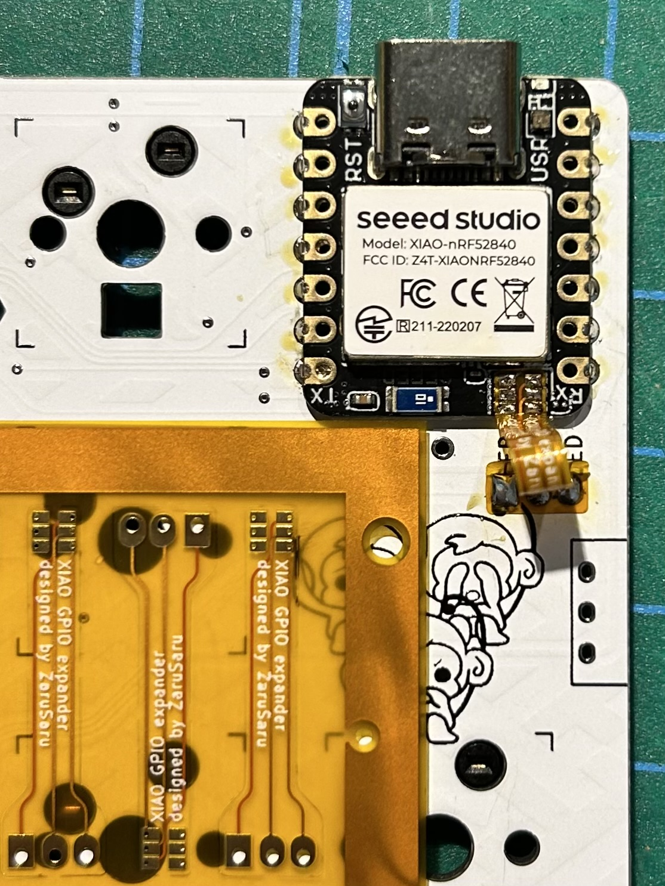
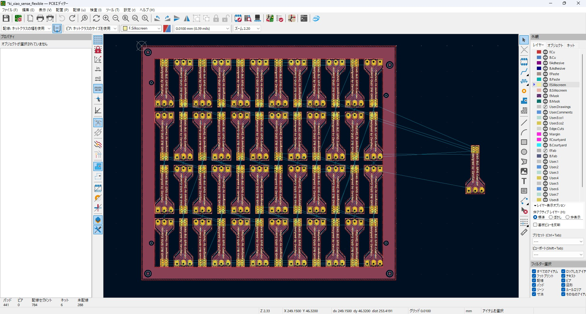

# XIAO BLE用 PDMマイクパッド引き出しFPCデータ

**Seeed Studio XIAO BLE** の未使用PDMマイク用パッドをメイン基板へと引き出すための **FPC（フレキシブルプリント基板）設計データ** を公開しています。

　
## 概要

XIAO BLEの本体に存在する未使用のPDMマイク用パッドを、外部のメイン基板に引き出すことで、追加のGPIOピンとして活用できるようになります。これにより、より多くのキーやトラックボール、センサーなどのデバイスを制御可能になります。

## 特徴

- **追加GPIOの活用**  
  PDMマイク用のパッドを使うことで、XIAO BLEの拡張性を高めることができます。
  
- **シンプルな接続構造**  
  メイン基板には2.54mmピッチのスルーホールを使用して接続します。FPC側・メイン基板側ともに同じフットプリントを使用してください。

- **簡単で強固な固定方法**  
  スルーホールに3ピンのピンヘッダを差し込み、裏面からハンダを流し込んだ後、ピンヘッダのプラスチック部分をカットすることで、確実に固定できます。

## データ内容

リポジトリ内の `.zip` ファイルには以下のKiCADデータが含まれています：

- `.kicad_pro`: KiCADプロジェクトファイル  
- `.kicad_pcb`: 10cm×10cmに面付けされたFPC基板データ（JLCPCBの基準に準拠）  
- `.kicad_sch`: 回路図データ  
- カスタムフットプリント・シンボルライブラリ  
- その他関連ファイル  

### PCB外観

基板の外観イメージはこちらです：

## JLCPCBでの発注

本データは、JLCPCBの **FPC Panelization Design Standards and Requirements** に準拠しています。修正なしでそのまま発注可能です。

詳細は以下を参照してください：  
[https://jlcpcb.com/blog/fpc-panelization-design-standards-and-requirements](https://jlcpcb.com/blog/fpc-panelization-design-standards-and-requirements)

## ライセンス

このプロジェクトは [MITライセンス](LICENSE) のもとで公開されています。改変・再配布・商用利用を含めて自由にご利用いただけます。
